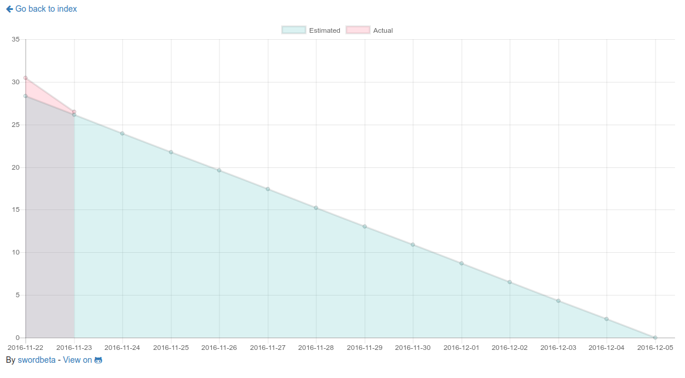
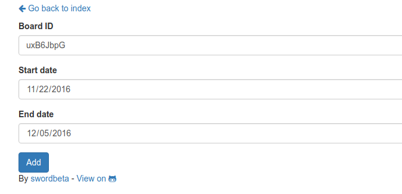
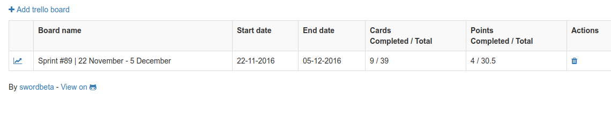

# trello-burndown
[](https://goreportcard.com/report/github.com/swordbeta/trello-burndown)

An easy to use SCRUM burndown chart for Trello boards.

Get quickly up and runnning with the [docker image](#docker-setup--running) or [binary](#binary-setup--running).

### How it works

- The points must be present in the title between parenthesis like so: `(2) Add login page`
- The last column of the board is where finished cards are found.
- Weekends are ignored. Points that were completed in the weekend are appointed to the next monday.

### Screenshots

#### Viewing a burndown chart


#### Adding a trello board


#### Index page with table of trello boards


### Installation

#### Obtain trello tokens
1. Login to [trello](https://trello.com)
2. [Generate a Developer API key](https://trello.com/app-key)
3. Generate a token by visiting the following URL:
`https://trello.com/1/authorize?name=trello-burndown&expiration=never&response_type=token&key=DEVELOPER_API_KEY`.
Replace "DEVELOPER_API_KEY" with the key you generated in the previous step.
4. Write both the Developer API key and the generated token down, you will need these to configure the application.

#### Docker: Setup & Running
1. Create a new directory to store the configuration and SQLite3 database.

    ```
    λ mkdir trello-burndown && cd trello-burndown
    ```

2. Create a file named `config.yaml` in the same directory, copy the contents from the default [here](https://github.com/swordbeta/trello-burndown/blob/master/config.yaml.default).
3. Edit the configuration file with your favorite editor and set the developer api key and generated token you wrote down earlier.
4. Run it! (Check [docker hub](https://hub.docker.com/r/swordbeta/trello-burndown/tags/) for available versions)

    ```
    λ docker run -d -p 8080:8080 --volume $(pwd):/root:Z swordbeta/trello-burndown:latest
    ```
    
    Note 1: The config file must be present in the /root directory inside the docker container.

    Note 2: `:Z` is required on systems with SELinux set to enforcing. 

#### Binary: Setup & Running
1. Download the latest release from [here](https://github.com/swordbeta/trello-burndown/releases).
2. Create a file named `config.yaml` in the same directory, copy the contents from the default [here](https://github.com/swordbeta/trello-burndown/blob/master/config.yaml.default).
3. Edit the configuration file with your favorite editor and set the developer api key and generated token you wrote down earlier.
4. Run it! You could run this as a daemon with upstart/supervisord/systemd/etc.

    ```
    λ ./trello-burndown
    ```
    
